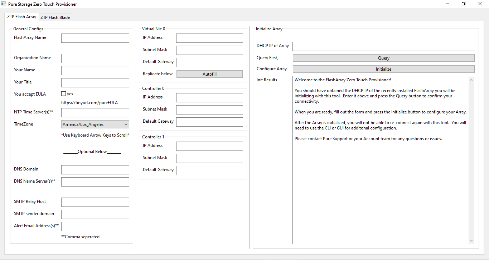
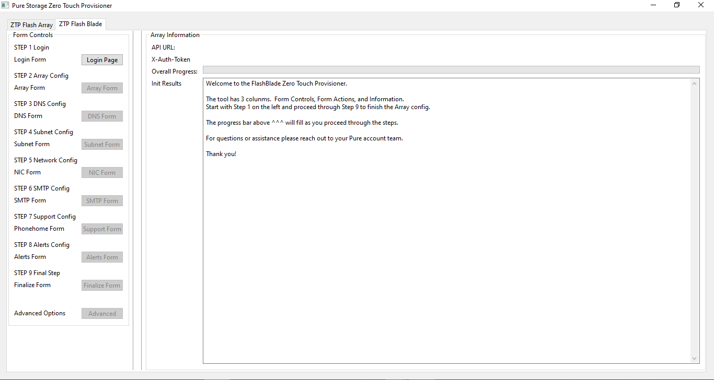

[](https://opensource.org/licenses/Apache-2.0) [](https://cla-assistant.io/PureStorage-OpenConnect/zero-touch-provisioner)

# FlashArray and FlashBlade Zero Touch Provisioner

Pure Storage FlashArray and FlashBlade Zero Touch Provisioner. This lightweight application allows engineers (or customers) to remotely initialize a new FA or FB using this cross-platform utility.

[FlashArray ZTP Support Article](https://support.purestorage.com/FlashArray/Getting_Started_with_FlashArray/FlashArray_Zero_Touch_Provisioning)

[FlashBlade ZTP Support Article](https://support.purestorage.com/FlashBlade/FlashBlade_KB_Internal_Staging/FlashBlade_Zero_Touch_Provisioning_-_Installation)

## Prerequisites and Requirements

#### FlashArray

##### Physical Installation of the FlashArray
The FlashArray remote deployment feature is available in Purity versions **5.2.4** and higher.
At the moment, the FlashArray is required to have **internet connectivity** due to the fact that one of the steps in the provisioning process checks for remote assist connectivity to Pure1.  

**If internet connectivity is not available, ZTP initialization will begin but provisioning will eventually fail.  ZTP is currently not support on Dark Sites.**

A new FlashArray pre-installed with Purity version **5.2.4** or above should be shipped to the customer’s Data Center. When the array is unpacked, if the serial number of the FlashArray and the MAC addresses of the management ports are printed on the array or on a document accompanying the array, this information should be saved. The FlashArray should then be racked and cabled up. See the FlashArray Hardware documentation for details.

##### DHCP Config
Ensure that DHCP Services available on the network connected to the managment ct0.eth0 and ct1.eth0 ports of the FlashArray.  Once the Flash Array boots up for the first time it will obtain DHCP IP's for both of these ports.  **You will use the ct1.eth0 DHCP IP address in the Zero Touch Provisioner tool**.

Optional step: For convenience, the DHCP server can be configured to assign specific IP addresses to the management ports on the FlashArray, based on the MAC address information that was found when unpacking the FlashArray. The advantage of using MAC-based IP address reservations in a DHCP server is that you don't have to search through the whole range of IP addresses in the DHCP server's IP pool to find the IP address of the FlashArray.

#### FlashBlade

##### FlashBlade Hardware Requirements
Only multi-chassis FlashBlade systems, or single-chassis FlashBlade systems equipped with EFM-310 are supported. EFM-110 models do not have the required out-of-band ports.

##### FlashBlade Software Requirements
Flashblade must be upgraded to a version supporting ZTP. For GA this is 3.0.0 or later. ZTP is supported for Service Now as a DA release in 2.4.d.

##### Data Center IT Environment Requirements
The data center IT environment requirements includes:

* Uplinks and out-of-band ports on the FlashBlade controllers are connected to the network.

* The DHCP server or relay agent is accessible by untagged broadcast from the out-of-band port (the top of rack switch may convert this traffic however the customer needs).

* The DHCP server must provide the following information:

  * IP address
  * subnet-mask
  * gateway (routers)

* It is recommended that the DHCP server be configured to register DHCP client addresses to a DNS server.  REST commands can then be directed at the FlashBlade using its advertised hostname, PS-FB-<component serial>-<component name>, that is registered with the DNS server.

* *Optional The FlashBlade will advertise a vendor-class-identifier of “Pure Storage | Flash Blade". This information can be used by the DHCP server to partition a separate address range specifically for FlashBlades that are in ZTP setup mode.

##### ZTP Preparation (fbsetup --ztp)
When preparing for ZTP, the **fbsetup** wizard must be run in **--ztp** mode to perform the initial configuration and activate the ZTP setup mode. This must occur after upgrading the Flashblade to a release capable of ZTP. Otherwise installation steps are identical to normal. This initial configuration consists of the following:

* Confirm the auto-detected number of blades for bootstrap.
* Change the ir user password.
* Confirm to restart the system.

##### Retrieve Hostname / Check ZTP Status
The ZTP status can be manually checked using **fbdiag ztp-setup**

This command will show the ZTP status as well as the DHCP IPs and Hostnames for each entry point if available.

#### Client Requirements

Windows 10 or higher, Linux with UI, or MAC OS.

Network Connectivity over port **8081** to the DHCP IP used by the FlashArray
Network Connectivity over port **80 and 443** to the DHCP IP used by the FlashBlade

```
For Windows, download and launch the appropriate .exe, fill out the form and go.
```

```
For Linux, (desktop GUI is required) download and launch appropriate ZTP binary, set it to executable "chmod +x", execute it and fill out the form.
```

```
For MacOS, download the appropriate ZTP binary, open terminal, set the binary to executable "chmod +x", execute it and fill out the form.
```

## Getting Started

Compiled binaries for Mac, Linux, and Windows are located in the Compiled directory.

Download the application binary relevant to your desktop OS and execute it.  Fill out the fields and your off.

The single console application has two tabs: FlashArray and FlashBlade.

#### FlashArray



The ZTP FlashArray tab is comprised of 3 columns.  Columnm 1 is the general configurations sections, Column 2 is the IP Addressing section and Column 3 is the Action and Output section.

To begin you will enter the Temp DHCP IP of FlashArray in the "DHCP IP of Array" field in column 3.  You can then Query the Array to make sure you have connectivity.

Next you will fill out the remainder of the fileds in Column 1 and Column 2 according to the specifics of the Array and environment.

When ready to initialize, press the Initialize Array button in Column 3 and view the results in the output window below. 

#### FlashBlade



Select the ZTP FlashBlade Tab.

The ZTP FlashBlade tab is comprised of 3 columns as well.  Column 1 provides the 9 Steps necessary to configure a FlashBlade in order of operation.  Each step contains a button that will display the relevant form and controls for the associated step.  Column 2 is the Form fields and controls to query and apply required configurations relevant to each of the 9 steps.  Column 3 provides the output of each action.

In order to authenticate to a FlashBlade using the ZTP tool, you will need the DHCP IP of the FlashBlade.

To begin you will can either query the FlashBlade to obtain the API versions and auto generate the API url for the "Array API URL" field or you can manually enter the API url in the "Array API URL" field.  If you manually enter the API URL you must include the version and have the format as http or ```https://<fqdn or ip of array>/api/<api version>```


When you have the API url in place, clicking the "Create Session" button should result in the API URL and x-auth-token labels in column 3 displaying the resulting values.  If you do not see a value listed in the x-auth-token label field then the session was not created.


When the above is successful you are ready to move to Step 2 - Step 9 in succession.

## Video Tutorial

[](https://youtu.be/LN13cpuA3Jc)

## Built With

* [UI](https://github.com/andlabs/ui/) - The GUI framework used
* [Validator v9](https://gopkg.in/go-playground/validator.v9) - form validation
* [GOLang](https://golang.org/) - Core
* [Crossbuild](https://github.com/magJ/go-ui-crossbuild) - Compiled with Go UI Crossbuild


## Authors

* **Brandon Showers* - - [GIBLAB](https://gitlab.com/btshowers)  OR  [About Me](https://bshowers.com)


## Acknowledgments

* Thanks Simon Dodsley for the hackathon to get me to learn GOLang!

